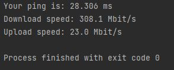

# internet-speed-test using the speedtest module

### pip install speedtest 

#### It takes a minute for Python to calculate your network's speed, as it does in Ookla's Speed Test app

#### A very simple and easy process with a few lines of code to perfectly demonstrate Python's powerful capabilities 

#### Output: 

